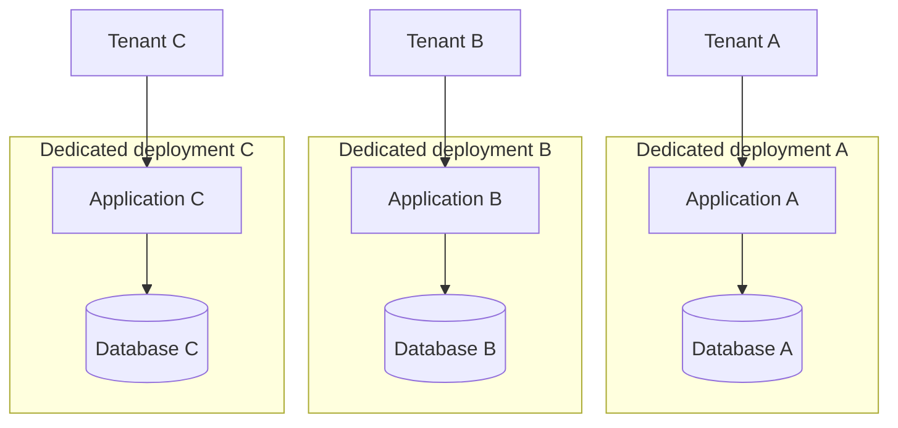
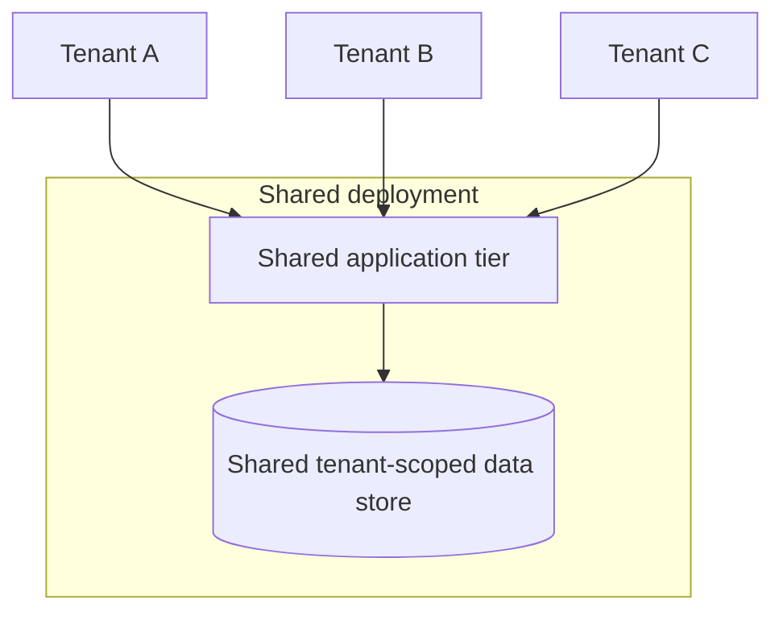
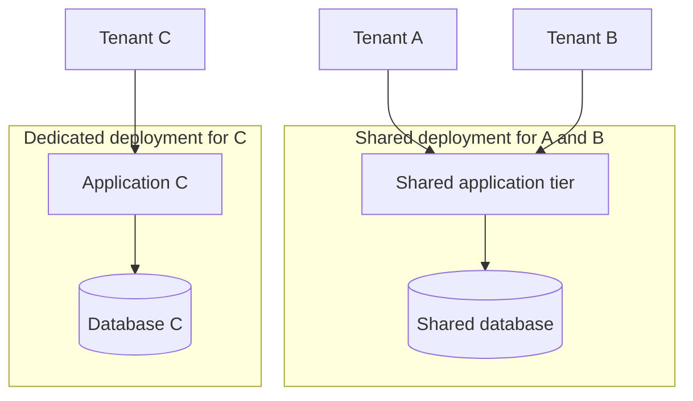
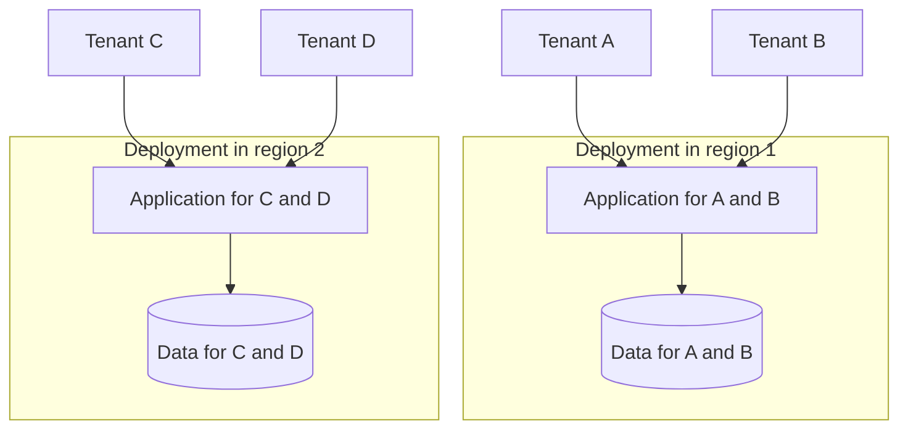
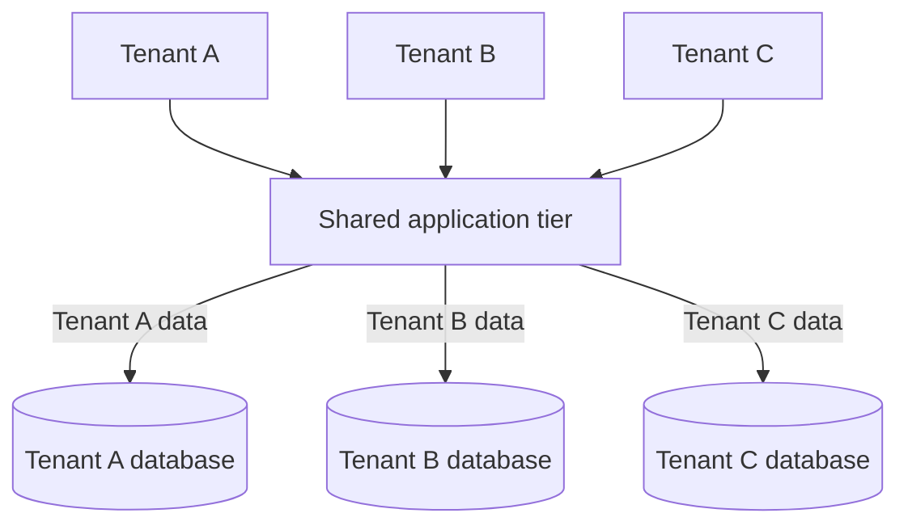

## 09 · Tenancy Model Diagrams

These conceptual Mermaid diagrams illustrate the models described in
[Microsoft's tenancy-model guidance][models]. They show how tenants map to
shared or dedicated resources, not a prescribed selection flow. Application
and data tiers are illustrative; arrows do not replace tenant-scoped
authorization or prove isolation.

### Automated single-tenant deployments

Each tenant has its own application and data resources. The depicted workload
resources are not shared between tenants.

Dedicated deployments reduce cross-tenant resource contention and allow
progressive updates across tenants. They also increase infrastructure and
fleet-maintenance overhead, so provisioning and updates need automation.

Source: [Microsoft: Automated single-tenant deployments][single-tenant].

### Fully multitenant deployments

All tenants share the application and data infrastructure. Tenant data remains
logically separated within the shared store.

Sharing improves resource utilization and reduces the number of deployments to
maintain. Tenant-scoped access, noisy-neighbor controls, per-tenant cost
attribution, and shared scale limits still need attention; a deployment change
can affect every tenant it hosts.

Source: [Microsoft: Fully multitenant deployments][fully-multitenant].

### Vertically partitioned deployments

Microsoft describes both mixed shared/dedicated deployments and geographic
partitioning under this model.

#### Shared and dedicated deployments

Tenants A and B share a deployment; tenant C has a dedicated application and
data stack.

This combines shared-resource efficiency with dedicated capacity or isolation
for selected tenants. The solution must support both deployment arrangements
and maintain tenant placement; moving tenants between them requires migration.

#### Geographic partitioning

Tenants map to deployments in different regions. Tenants within a regional
deployment can share resources; geographic partitioning does not require
dedicated infrastructure for every tenant.

Regional placement supports tenants in different geographies, with additional
deployment and routing management. The diagram does not imply cross-region
replication or failover; those are separate design decisions.

Source for both examples: [Microsoft: Vertically partitioned deployments][vertical].

### Horizontally partitioned deployments

The application tier is shared, while each tenant has a dedicated database.
Other components can be isolated in the same way.

Dedicated components can reduce contention at that tier while preserving
sharing elsewhere. The shared application still needs tenant-scoped
authorization and routing, and per-tenant components need automated management.

Source: [Microsoft: Horizontally partitioned deployments][horizontal].

For definitions and a comparison table, see
[Tenancy Models & Isolation](tenancy-models.md). For selection considerations,
see Microsoft's [Decide which model to use][selection].

[models]: https://learn.microsoft.com/azure/architecture/guide/multitenant/considerations/tenancy-models
[single-tenant]: https://learn.microsoft.com/azure/architecture/guide/multitenant/considerations/tenancy-models#automated-single-tenant-deployments
[fully-multitenant]: https://learn.microsoft.com/azure/architecture/guide/multitenant/considerations/tenancy-models#fully-multitenant-deployments
[vertical]: https://learn.microsoft.com/azure/architecture/guide/multitenant/considerations/tenancy-models#vertically-partitioned-deployments
[horizontal]: https://learn.microsoft.com/azure/architecture/guide/multitenant/considerations/tenancy-models#horizontally-partitioned-deployments
[selection]: https://learn.microsoft.com/azure/architecture/guide/multitenant/considerations/tenancy-models#decide-which-model-to-use
