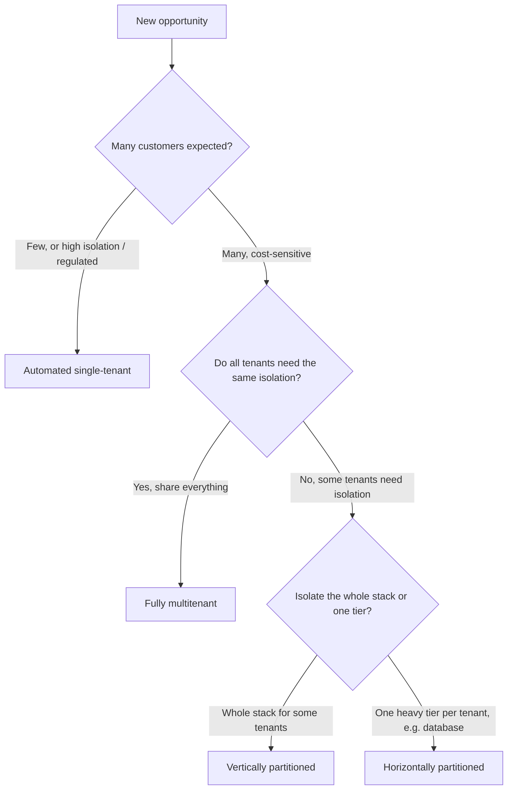

# 08 · Tenancy Decision Guide

::: info TL;DR
Tenancy is a **commercial *and* technical** decision across
business objectives, compliance, scale, automation capacity, and SLAs.
Expecting many customers pushes toward shared infrastructure; few customers
or high isolation needs can justify single-tenant. 
:::

## Decision flow

## Decision factors

Weigh these factors when choosing a model :

| Factor | Pushes toward sharing | Pushes toward isolation |
| --- | --- | --- |
| **Business objectives** | Many customers, cost-sensitive | Premium / dedicated offers |
| **Compliance & residency** | Standard requirements | Regulated data, sovereign regions, customer-managed keys |
| **Scale** | Very high tenant counts | Few, very large tenants |
| **Automation capacity** | Mature IaC and pipelines | Limited automation (favor fewer moving parts) |
| **SLAs** | Uniform SLA across tenants | Differentiated SLAs per tier |

## When to choose each model

| If you… | Choose |
| --- | --- |
| Have **few customers** or strict isolation/regulatory needs | **Automated single-tenant** |
| Expect **many, cost-sensitive** tenants with uniform needs | **Fully multitenant** |
| Serve a **mixed base** where some tenants pay for full isolation | **Vertically partitioned** |
| Need to isolate the **one tier that carries most load** (often data) | **Horizontally partitioned** |

::: tip ✅ Do
- Document the decision and its trade-offs in the tenant-to-deployment map.
- Revisit the choice as customer count and compliance needs change.
:::

::: danger ⛔ Avoid
- Defaulting to single-tenant "for safety" when you expect many customers —
  cost efficiency collapses (100 tenants ≈ 100× cost).
- Choosing fully multitenant when a subset of tenants has hard isolation or
  residency requirements.
:::

